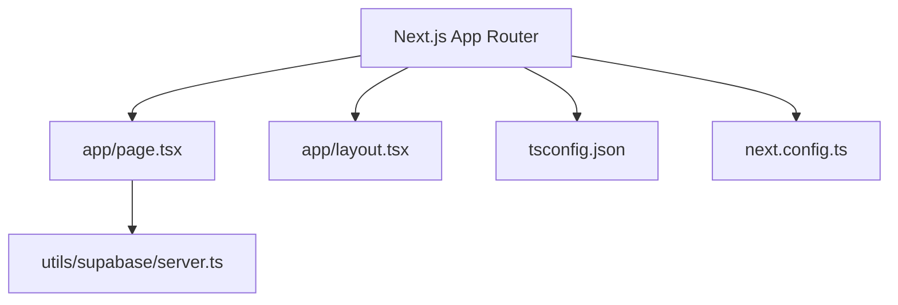

# Configurações do Projeto (Next.js & TypeScript)

## Propósito
Este documento detalha a infraestrutura de build e desenvolvimento do projeto, garantindo a modularidade, o suporte ao TypeScript e a integração com a Vercel.

## Arquivos de Configuração

### 1. `package.json`
Contém as dependências fundamentais para o ecossistema Next.js com suporte a Server Components:
- **`next`**: Framework web.
- **`react` & `react-dom`**: Renderização UI.
- **`typescript` & `@types/*`**: Tipagem estática robusta.
- **Scripts**:
  - `npm run dev`: Inicia o servidor de desenvolvimento local.
  - `npm run build`: Compila a aplicação para produção (verificado pela Vercel).
  - `npm run start`: Inicia o build de produção.

### 2. `tsconfig.json`
Configurações do compilador TypeScript adaptadas ao Next.js App Router:
- `paths`: Mapeamento de caminhos relativos utilizando `@/*` apontando para a raiz do repositório para evitar imports profundos complexos (`../../`).
- `plugins`: Ativa o plugin do Next.js para otimização de rotas e tipagem de páginas.

### 3. `next.config.ts`
Configurações de runtime do Next.js.
- Mantido no formato de TypeScript nativo compatível com o bundler do Next.js 15.

## Relações de Dependência

