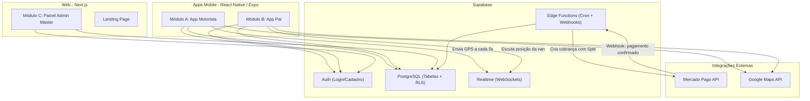

# Arquitetura e Stack Tecnológica

## Propósito
Detalhar a fundação tecnológica do projeto **Tio da Van**, os três módulos de interface e como se conectam ao mesmo banco de dados centralizado.

---

## 1. Stack Tecnológica

| Camada | Tecnologia | Versão Alvo | Função |
| --- | --- | --- | --- |
| Front-end Móvel | React Native (Expo) | SDK 52+ | Apps de Pais e Motoristas (GPS, Push Notifications) |
| Front-end Web | Next.js (App Router) | 15+ | Painel Admin Master + Landing Page |
| Back-end & DB | Supabase (PostgreSQL) | — | Auth, banco relacional, RLS, Edge Functions |
| Tempo Real | Supabase Realtime | — | WebSockets para GPS tracking e notificações |
| Pagamento | Mercado Pago API | v1 | Pix, cobranças recorrentes, Split 95/5 |
| Mapas | Google Maps API | — | Renderização de mapa, geocoding, rotas, ETA |

---

## 2. Diagrama de Arquitetura

---

## 3. Módulos do Sistema

### Módulo A: App do Motorista (Operacional)
- **Plataforma:** React Native / Expo
- **Responsabilidades:**
  - Cadastro de frota (placa, capacidade, bairros, escolas)
  - Painel de bordo diário (Embarcou / Entregue / Faltou)
  - Transmissão de GPS em tempo real (botão "Iniciar Rota")
  - Dashboard financeiro (saldo, devedores, pagos)

### Módulo B: App do Pai/Responsável (Cliente)
- **Plataforma:** React Native / Expo
- **Responsabilidades:**
  - Motor de match (endereço x escola → motoristas compatíveis)
  - Tracking ao vivo da van no mapa com ETA
  - Botão de aviso de ausência do aluno
  - Carteira (faturas, histórico, Pix Copia e Cola)

### Módulo C: Painel Administrativo Master
- **Plataforma:** Next.js (App Router)
- **Responsabilidades:**
  - Visão global de faturamento e receita líquida (5%)
  - Auditoria e aprovação de cadastros de motoristas
  - Relatórios operacionais e financeiros

---

## 4. Relação entre Repositórios

| Repositório | Conteúdo | Observação |
| --- | --- | --- |
| `Tio-da-van` (este) | Next.js — Painel Admin + Landing Page | Repositório atual |
| `tio-da-van-app` (futuro) | React Native — Apps Motorista e Pai | A ser criado na Fase 2 |
