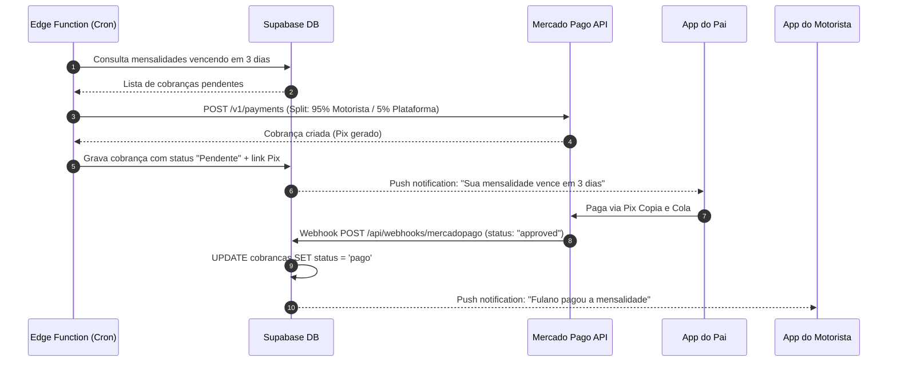
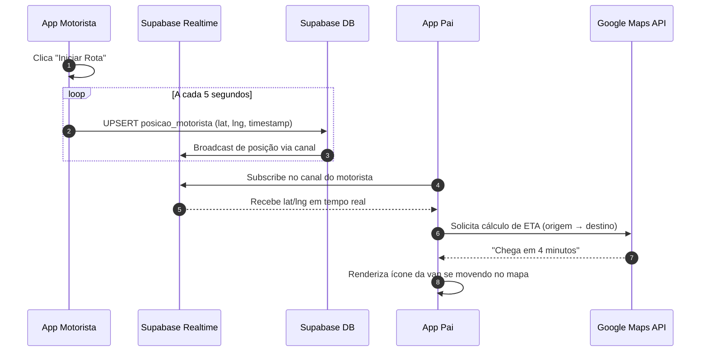

# Engenharia de Integração

## Propósito
Documentar os dois motores autônomos que fazem o **Tio da Van** funcionar sem intervenção manual: o motor financeiro (Mercado Pago) e o motor de rastreamento (WebSockets).

---

## 1. Motor Financeiro (Mercado Pago + Webhooks)

### Fluxo Completo do Ciclo de Pagamento

### Detalhes Técnicos

| Item | Valor |
| --- | --- |
| **Endpoint de Webhook** | `POST /api/webhooks/mercadopago` (Route Handler Next.js ou Edge Function Supabase) |
| **Split de Pagamento** | 95% para o motorista / 5% para a plataforma |
| **Frequência do Cron** | Diário à meia-noite (00:00 UTC-3) |
| **Antecedência de Cobrança** | 3 dias antes do vencimento |
| **Métodos de Pagamento** | Pix (principal), Boleto (secundário) |

### Modelo de Dados Envolvido
- **Tabela `cobrancas`**: `id`, `motorista_id`, `pai_id`, `aluno_id`, `valor`, `valor_plataforma` (5%), `valor_motorista` (95%), `status` (pendente/pago/vencido/cancelado), `mercadopago_payment_id`, `pix_copia_cola`, `vencimento`, `pago_em`, `created_at`.

---

## 2. Motor de Rastreamento (Supabase Realtime / WebSockets)

### Fluxo Completo do Tracking GPS

### Detalhes Técnicos

| Item | Valor |
| --- | --- |
| **Canal Realtime** | `posicao:motorista_{id}` |
| **Frequência de Envio** | A cada 5 segundos enquanto rota ativa |
| **Dados Transmitidos** | `{ lat, lng, heading, speed, timestamp }` |
| **Mapa** | Google Maps JavaScript API (Web) / React Native Maps (Mobile) |
| **ETA** | Google Maps Directions API |

### Modelo de Dados Envolvido
- **Tabela `posicao_motorista`**: `id`, `motorista_id`, `latitude`, `longitude`, `heading`, `speed`, `rota_ativa` (boolean), `updated_at`.

---

## 3. Notificações Push

| Evento | Destinatário | Mensagem Exemplo |
| --- | --- | --- |
| Cobrança criada | Pai | "Sua mensalidade de R$350 vence em 3 dias. Pague via Pix." |
| Pagamento confirmado | Motorista | "Fulano pagou a mensalidade de Maio." |
| Aluno ausente | Motorista | "João não irá hoje (turno manhã)." |
| Van partiu | Pai | "A van iniciou a rota. Acompanhe ao vivo." |
| Van chegando | Pai | "A van está a 2 min de distância." |
