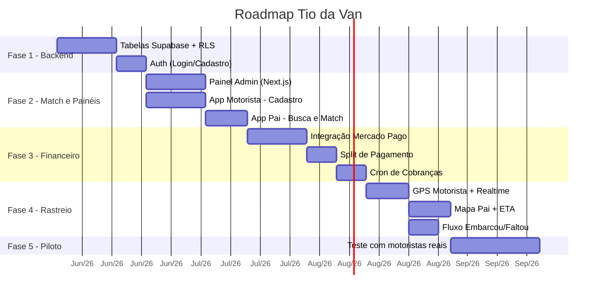

# Roadmap de Produção

## Propósito
Definir a ordem lógica de engenharia para construção incremental do **Tio da Van**, evitando retrabalho e garantindo que cada fase entregue valor funcional completo.

---

## Visão Geral das Fases

---

## Detalhamento por Fase

### Fase 1: Estrutura Basal (Backend)
> **Objetivo:** Ter o banco de dados seguro e funcional, com autenticação operacional.

| Entregável | Descrição |
| --- | --- |
| Tabelas no Supabase | `usuarios`, `motoristas`, `alunos`, `cobrancas`, `posicao_motorista` |
| Row Level Security (RLS) | Políticas isolando dados: pai só vê seus alunos, motorista só vê seus passageiros |
| Auth | Login/Cadastro via Supabase Auth (e-mail + senha), com roles (`pai`, `motorista`, `admin`) |
| Edge Functions | Estrutura base para webhooks e cron jobs |

**Pré-requisitos:** Conta Supabase criada, variáveis de ambiente configuradas.

---

### Fase 2: Motor de Match e Painéis
> **Objetivo:** Motorista cadastra sua rota, pai pesquisa e se vincula.

| Entregável | Descrição |
| --- | --- |
| Painel Admin (Next.js) | Dashboard com visão de motoristas, alunos e faturamento |
| App Motorista - Cadastro | Tela de cadastro da van (placa, capacidade, bairros, escolas) |
| App Pai - Match | Motor de busca cruzada (bairro x escola → motoristas compatíveis) |
| Vínculo Pai-Motorista | Fluxo de solicitação e aprovação de vínculo |

**Pré-requisitos:** Fase 1 completa, projeto Expo inicializado (`tio-da-van-app`).

---

### Fase 3: O Coração Financeiro
> **Objetivo:** Dinheiro circulando de forma autônoma via Mercado Pago.

| Entregável | Descrição |
| --- | --- |
| Integração Mercado Pago | Criação de pagamentos Pix via API |
| Split de Pagamento | Configuração do split 95% motorista / 5% plataforma |
| Cron de Cobranças | Edge Function rodando à meia-noite, gerando cobranças 3 dias antes do vencimento |
| Webhook | Route Handler recebendo confirmações de pagamento e atualizando `cobrancas` |
| Carteira do Pai | Tela com faturas, status e Pix Copia e Cola |
| Dashboard Financeiro do Motorista | Saldo, devedores e histórico de recebimentos |

**Pré-requisitos:** Fase 2 completa, conta Mercado Pago configurada com credenciais de sandbox.

---

### Fase 4: Rastreio e Logística
> **Objetivo:** Mapa ao vivo e controle diário de embarque/desembarque.

| Entregável | Descrição |
| --- | --- |
| Transmissão GPS | App Motorista envia lat/lng a cada 5s via Supabase Realtime |
| Mapa ao Vivo | App Pai renderiza posição da van com Google Maps + calcula ETA |
| Painel de Bordo | Tela do motorista com lista de alunos do dia: Embarcou / Entregue / Faltou |
| Notificação de Ausência | Pai envia aviso rápido de falta → motorista recebe push |

**Pré-requisitos:** Fase 3 completa, chave da Google Maps API ativa.

---

### Fase 5: Piloto em Arapongas
> **Objetivo:** Validar o modelo em campo com usuários reais.

| Entregável | Descrição |
| --- | --- |
| Recrutamento | 2-3 motoristas parceiros na região do Centro e bairros adjacentes |
| Onboarding | Cadastro assistido dos motoristas e primeiros pais |
| Monitoramento | Acompanhamento diário de rotas, pagamentos e feedback |
| Ajustes | Correções de bugs e melhorias baseadas no uso real |

**Pré-requisitos:** Fases 1-4 completas, app publicado em beta (TestFlight / Google Play Beta).
