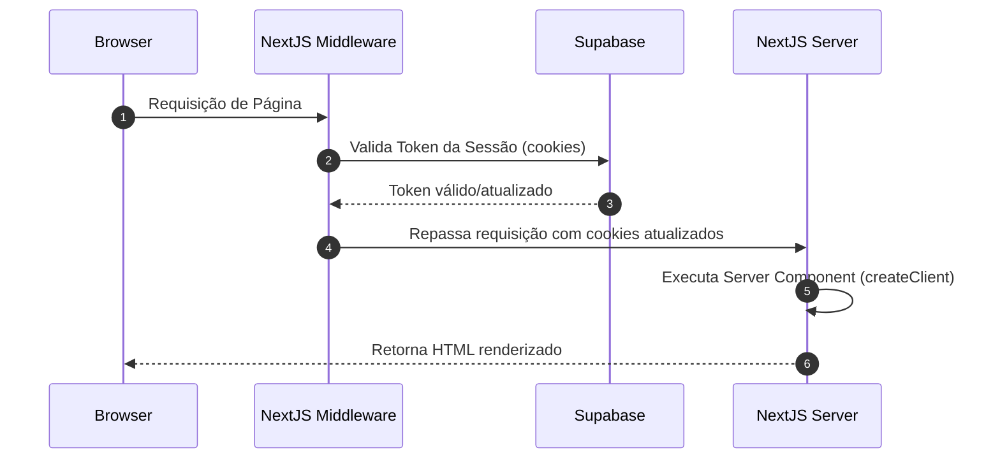

# Hooks e Utilidades: Supabase Clients

## Propósito
Este módulo encapsula a criação de clientes Supabase otimizados para diferentes ambientes de execução do Next.js App Router (Server Components, Route Handlers, Middleware e Client Components), gerenciando a autenticação e cookies automaticamente através do pacote `@supabase/ssr`.

## Arquivos e Métodos

### 1. Client Helper (Browser)
- **Arquivo**: [client.ts](file:///c:/Users/NOSSA%20WEBTV/Documents/GitHub/Tio-da-van/utils/supabase/client.ts)
- **Assinatura**: `createClient(): SupabaseClient`
- **Uso**: Utilizado exclusivamente em **Client Components** (`"use client"`). Evita recriações desnecessárias mantendo uma única instância do browser.

### 2. Server Helper (Server Component / Actions)
- **Arquivo**: [server.ts](file:///c:/Users/NOSSA%20WEBTV/Documents/GitHub/Tio-da-van/utils/supabase/server.ts)
- **Assinatura**: `createClient(cookieStore): SupabaseClient`
- **Uso**: Utilizado em **Server Components**, **Server Actions** e **Route Handlers** (API). Permite ler e gravar cookies na resposta do servidor.

### 3. Middleware Helper (Session Refresh)
- **Arquivo**: [middleware.ts](file:///c:/Users/NOSSA%20WEBTV/Documents/GitHub/Tio-da-van/utils/supabase/middleware.ts)
- **Assinatura**: `createClient(request): NextResponse`
- **Uso**: Responsável por atualizar o token de sessão ativa em cada requisição e sincronizar os cookies entre o cliente e o servidor.

## Relações e Fluxo de Autenticação

