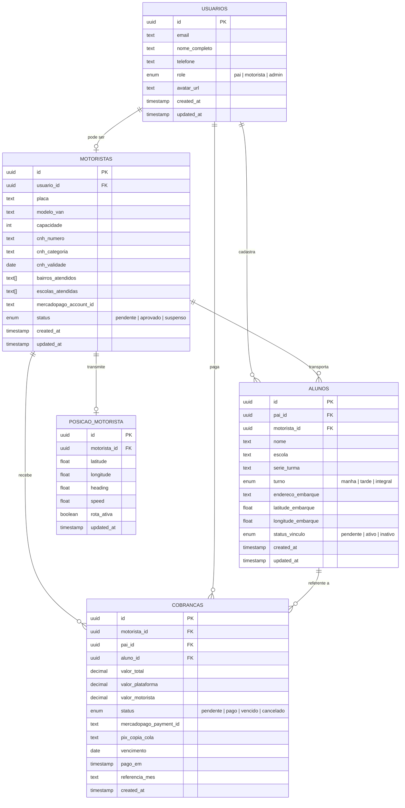

# Esquema de Banco de Dados (Supabase / PostgreSQL)

## Propósito
Definir a estrutura completa das tabelas do **Tio da Van**, seus tipos, relações e índices. Este é o contrato inquebável que o front-end deve respeitar.

---

## Diagrama Entidade-Relacionamento



---

## Definição das Tabelas

### 1. `usuarios`
Cadastro geral do sistema. Todo usuário possui uma role.

| Coluna | Tipo | Restrições | Descrição |
| --- | --- | --- | --- |
| `id` | `uuid` | PK, default `gen_random_uuid()` | Chave primária |
| `email` | `text` | UNIQUE, NOT NULL | E-mail de login |
| `nome_completo` | `text` | NOT NULL | Nome exibido na plataforma |
| `telefone` | `text` | — | WhatsApp / contato |
| `role` | `text` | NOT NULL, CHECK(`pai`,`motorista`,`admin`) | Nível de acesso |
| `avatar_url` | `text` | — | URL da foto de perfil |
| `created_at` | `timestamptz` | default `now()` | Data de criação |
| `updated_at` | `timestamptz` | default `now()` | Última atualização |

---

### 2. `motoristas`
Extensão do usuário com role `motorista`. Contém dados da van e área de atuação.

| Coluna | Tipo | Restrições | Descrição |
| --- | --- | --- | --- |
| `id` | `uuid` | PK, default `gen_random_uuid()` | Chave primária |
| `usuario_id` | `uuid` | FK → `usuarios.id`, UNIQUE | Vínculo com o usuário |
| `placa` | `text` | NOT NULL | Placa da van |
| `modelo_van` | `text` | NOT NULL | Modelo/marca do veículo |
| `capacidade` | `int` | NOT NULL, CHECK > 0 | Lotação máxima |
| `cnh_numero` | `text` | NOT NULL | Número da CNH |
| `cnh_categoria` | `text` | NOT NULL | Categoria (D ou E) |
| `cnh_validade` | `date` | NOT NULL | Validade da CNH |
| `bairros_atendidos` | `text[]` | — | Array de nomes de bairros |
| `escolas_atendidas` | `text[]` | — | Array de nomes de escolas |
| `mercadopago_account_id` | `text` | — | ID da subconta no Mercado Pago (para split) |
| `status` | `text` | NOT NULL, CHECK(`pendente`,`aprovado`,`suspenso`) | Status de aprovação pelo admin |
| `created_at` | `timestamptz` | default `now()` | Data de criação |
| `updated_at` | `timestamptz` | default `now()` | Última atualização |

---

### 3. `alunos`
Estudantes vinculados a um pai e (opcionalmente) a um motorista.

| Coluna | Tipo | Restrições | Descrição |
| --- | --- | --- | --- |
| `id` | `uuid` | PK, default `gen_random_uuid()` | Chave primária |
| `pai_id` | `uuid` | FK → `usuarios.id`, NOT NULL | Pai/responsável |
| `motorista_id` | `uuid` | FK → `motoristas.id`, nullable | Motorista vinculado |
| `nome` | `text` | NOT NULL | Nome do aluno |
| `escola` | `text` | NOT NULL | Nome da escola |
| `serie_turma` | `text` | — | Série/turma |
| `turno` | `text` | NOT NULL, CHECK(`manha`,`tarde`,`integral`) | Turno escolar |
| `endereco_embarque` | `text` | NOT NULL | Endereço de embarque |
| `latitude_embarque` | `float8` | — | Lat do ponto de embarque |
| `longitude_embarque` | `float8` | — | Lng do ponto de embarque |
| `status_vinculo` | `text` | NOT NULL, default `pendente`, CHECK(`pendente`,`ativo`,`inativo`) | Status do vínculo com motorista |
| `created_at` | `timestamptz` | default `now()` | Data de criação |
| `updated_at` | `timestamptz` | default `now()` | Última atualização |

---

### 4. `cobrancas`
Controle financeiro de mensalidades.

| Coluna | Tipo | Restrições | Descrição |
| --- | --- | --- | --- |
| `id` | `uuid` | PK, default `gen_random_uuid()` | Chave primária |
| `motorista_id` | `uuid` | FK → `motoristas.id`, NOT NULL | Motorista recebedor |
| `pai_id` | `uuid` | FK → `usuarios.id`, NOT NULL | Pai pagador |
| `aluno_id` | `uuid` | FK → `alunos.id`, NOT NULL | Aluno referente |
| `valor_total` | `numeric(10,2)` | NOT NULL | Valor cheio da mensalidade |
| `valor_plataforma` | `numeric(10,2)` | NOT NULL | 5% retido pela plataforma |
| `valor_motorista` | `numeric(10,2)` | NOT NULL | 95% repassado ao motorista |
| `status` | `text` | NOT NULL, default `pendente`, CHECK(`pendente`,`pago`,`vencido`,`cancelado`) | Status do pagamento |
| `mercadopago_payment_id` | `text` | — | ID do pagamento no Mercado Pago |
| `pix_copia_cola` | `text` | — | Código Pix para pagamento |
| `vencimento` | `date` | NOT NULL | Data de vencimento |
| `pago_em` | `timestamptz` | — | Data/hora do pagamento efetivo |
| `referencia_mes` | `text` | NOT NULL | Mês de referência (ex: "2026-06") |
| `created_at` | `timestamptz` | default `now()` | Data de criação |

---

### 5. `posicao_motorista`
Posição GPS em tempo real do motorista (uma linha por motorista, atualizada via UPSERT).

| Coluna | Tipo | Restrições | Descrição |
| --- | --- | --- | --- |
| `id` | `uuid` | PK, default `gen_random_uuid()` | Chave primária |
| `motorista_id` | `uuid` | FK → `motoristas.id`, UNIQUE | Motorista rastreado |
| `latitude` | `float8` | NOT NULL | Latitude atual |
| `longitude` | `float8` | NOT NULL | Longitude atual |
| `heading` | `float8` | — | Direção em graus (0-360) |
| `speed` | `float8` | — | Velocidade em km/h |
| `rota_ativa` | `boolean` | NOT NULL, default `false` | Se a van está em rota |
| `updated_at` | `timestamptz` | default `now()` | Último update de posição |

---

## Índices Recomendados

```sql
-- Busca cruzada de motoristas por bairro/escola (Match engine)
CREATE INDEX idx_motoristas_bairros ON motoristas USING GIN (bairros_atendidos);
CREATE INDEX idx_motoristas_escolas ON motoristas USING GIN (escolas_atendidas);

-- Consulta de alunos por pai ou motorista
CREATE INDEX idx_alunos_pai ON alunos (pai_id);
CREATE INDEX idx_alunos_motorista ON alunos (motorista_id);

-- Consulta de cobranças por status e vencimento (usado pelo Cron)
CREATE INDEX idx_cobrancas_vencimento ON cobrancas (vencimento) WHERE status = 'pendente';
CREATE INDEX idx_cobrancas_motorista ON cobrancas (motorista_id);
CREATE INDEX idx_cobrancas_pai ON cobrancas (pai_id);

-- Posição ativa do motorista
CREATE INDEX idx_posicao_ativa ON posicao_motorista (motorista_id) WHERE rota_ativa = true;
```
